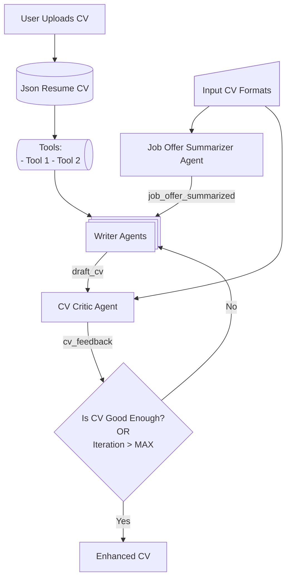

# cv-enhancer-gen-ai

```mermaid
flowchart TD
    A[User Uploads CV] --> JsonCV[(Json Resume CV)]
    JsonCV --> Tools@{ shape: das, label: "Tools:\n- Tool 1\n- Tool 2" }

    Input@{ shape: sl-rect, label: "Input CV Formats" }
    --> JobOfferSummAgent@{ shape: rect, label: "Job Offer Summarizer Agent" }
    -- job_offer_summarized --> WriterAgents@{ shape: processes, label: "Writer Agents" }
    Tools --> WriterAgents
    -- draft_cv --> CriticAgent@{ shape: rect, label: "CV Critic Agent" }
    Input --> CriticAgent
    -- cv_feedback --> Decision@{ shape: diamond, label: "Is CV Good Enough?\nOR\nIteration > MAX" }

    Decision -- No --> WriterAgents
    Decision -- Yes --> Output[Enhanced CV]
```
