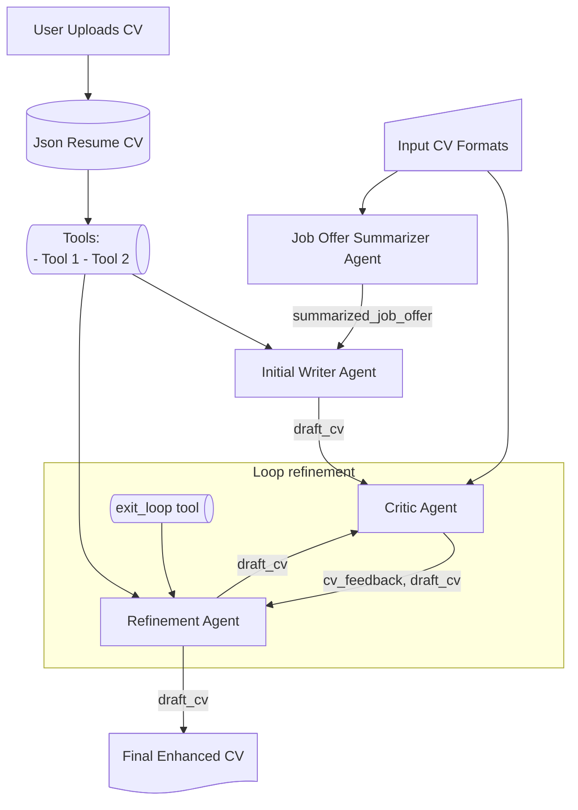

# cv-enhancer-gen-ai

# TODO

- [ ] Implement the agents
- [ ] Add a tool to get job descriptions from job offers

    JobOfferSummAgent -- summarized_job_offer --> WriterAgents@{ shape: processes, label: "Writer Agents" }
