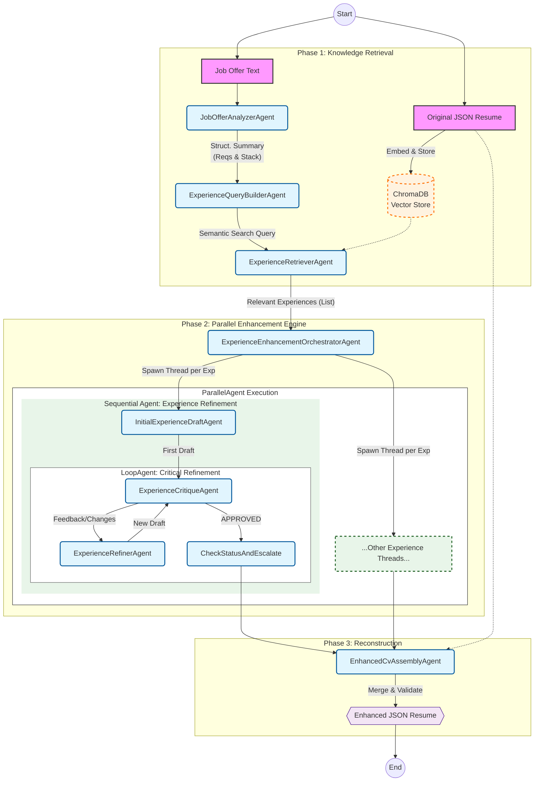

# cv-enhancer-gen-ai

## Installation and use

1. Clone the repository:

    ```bash
    git clone https://github.com/framunoz/cv-enhancer-gen-ai.git
    cd cv-enhancer-gen-ai
    ```

2. Create and activate a virtual environment:

    ```bash
    uv venv
    source .venv/bin/activate  # On Windows use `venv\Scripts\activate`
    uv sync
    ```

3. Add your Google API key to the `.env` file in the `notebooks` directory:

    ```bash
    cp notebooks/.env.example notebooks/.env
    ```

    Then edit `notebooks/.env` to include your actual API key:

    ```bash
    GOOGLE_API_KEY=your_google_api_key_here
    ```

4. Load your CV using the [json resume schema](https://jsonresume.org/schema/) (we include an additional field for stacks per experience, an example can be found in [/data/json_resume_example.json](./data/json_resume_example.json)).

5. Open the notebook [01-cv-enhancer-prototype.ipynb](./notebooks/01-cv-enhancer-prototype.ipynb) and run the cells to enhance your CV based on a job offer. Introduce your CV file path and the job offer text when prompted.

## Architecture



## Architecture planning (it is not the current implementation)


## Saving the CV

1. Receive the CV in a text format (plain or json resume) and save it as a json resume.
2. Get the stacks and skills per experience. For this, follow these steps:
    1. Iterate over each experience in the CV.
    2. For each experience, identify the relevant skills and technologies used.
    3. Save the stacks and skills associated with each experience in the json resume.
    4. Ensure that the skills are categorized by type (e.g., technical, soft skills).

## TODO

- [ ] Implement the agents
- [ ] Add a tool to get job descriptions from job offers
- [ ] Improve the u¿instructions to generate an API key for Google
- [ ] Improve instructions to create virtual environment with `uv`
